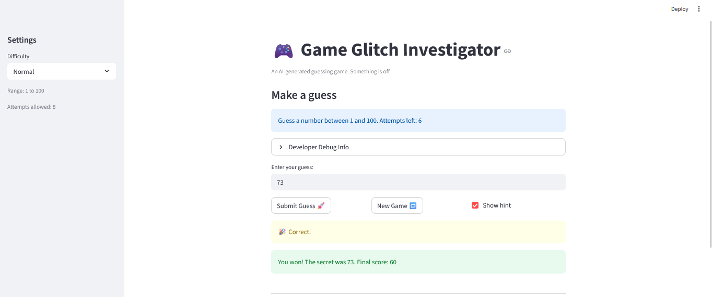

# 🎮 Game Glitch Investigator: The Impossible Guesser

## 🚨 The Situation

You asked an AI to build a simple "Number Guessing Game" using Streamlit.
It wrote the code, ran away, and now the game is unplayable. 

- You can't win.
- The hints lie to you.
- The secret number seems to have commitment issues.

## 🛠️ Setup

1. Install dependencies: `pip install -r requirements.txt`
2. Run the broken app: `python -m streamlit run app.py`

## 🕵️‍♂️ Your Mission

1. **Play the game.** Open the "Developer Debug Info" tab in the app to see the secret number. Try to win.
2. **Find the State Bug.** Why does the secret number change every time you click "Submit"? Ask ChatGPT: *"How do I keep a variable from resetting in Streamlit when I click a button?"*
3. **Fix the Logic.** The hints ("Higher/Lower") are wrong. Fix them.
4. **Refactor & Test.** - Move the logic into `logic_utils.py`.
   - Run `pytest` in your terminal.
   - Keep fixing until all tests pass!

## 📝 Document Your Experience

- [ ] Describe the game's purpose.
[ ] The purpose of the game is to provide a guessing game for numbers 1-100, 1-20, or 1-50 based on the difficulty and geuessing the correct number in the given range.
- [ ] Detail which bugs you found.
4 bugs were found. The hints were not working as intended. For guesses that were signifcantly less than the secret number a hint of go lower was given and guesses that were significantly greater than the secret number a hint of go higher was given. The attempts for each diffculty were off by 1 when the game started. The game doesnt restart after clcking new game. The secret number kept changing after every guess.
- [ ] Explain what fixes you applied.
[ ] For the hints I changed the order for the statements in the if conditions. For the attempts I changed the attempts at the start of the game from 1 to 0. For the new game I made sure to reste the st.session_state.statsu to playing whenever the new game button was clicked to indicate a new game has started. 
For the scret number instead of converting it to a strign for even attempts and int for odd attempts just assinging it as an integer to rmeove type inconsistenices. 

## 📸 Demo

- [ ] 
[ ] 

## 🚀 Stretch Features

- [ ] [If you choose to complete Challenge 4, insert a screenshot of your Enhanced Game UI here]

[